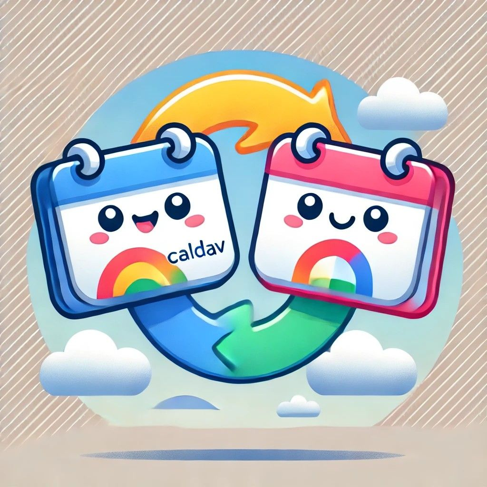

# CalDAV2GoogleCalendar

<p align="center">
  
</p>

[](https://codecov.io/gl/rogs/caldav2google)
[](https://git.rogs.me/rogs/caldav2google/actions)

A Python utility to synchronize events from a CalDAV calendar to Google Calendar, maintaining a local state to track changes.

## Features
- One-way synchronization from CalDAV to Google Calendar
- Intelligent change detection using event UIDs and modification timestamps:
  - Adds new events not present in Google Calendar
  - Updates modified events based on last-modified timestamp
  - Removes events deleted from CalDAV source
- Local state management via JSON file to track synchronized events
- Detailed logging of synchronization activities
- Built-in rate limiting (0.5s delay between API calls) to prevent Google Calendar API throttling
- Comprehensive error tracking with failed events reporting
- UTC timezone handling for consistent event timing

## Prerequisites

### 1. Python Environment
- Python 3.9 or higher (uv can download a suitable version for you)
- [uv](https://docs.astral.sh/uv/) for dependency management
- Required Python packages (installed automatically by `uv sync`):
  - `caldav` (>=1.4.0, <2) - For CalDAV server interaction
  - `icalendar` (>=6.1.0, <7) - For iCalendar format parsing
  - `google-api-python-client` (>=2.154.0, <3) - For Google Calendar API
  - `python-dotenv` (>=1.0.1, <2) - For environment variable management

### 2. CalDAV Server Details
You'll need:
- CalDAV server URL
- Username
- Password
- Calendar name to synchronize (case-insensitive matching)

### 3. Google Calendar Setup

To interact with the Google Calendar API, follow these steps:

1. Go to the [Google Cloud Console](https://console.cloud.google.com/).
2. Create a new project or select an existing one.
3. Enable the **Google Calendar API** for the project.
4. Create OAuth 2.0 credentials:
   - Go to **APIs & Services > Credentials**.
   - Click **Create Credentials** > **OAuth Client ID**.
   - Configure the consent screen (if not already done).
   - Select **Desktop App** as the application type.
   - Download the `credentials.json` file.
5. Place the `credentials.json` file in the project directory.

## Installation

1. Clone the repository:
   ```bash
   git clone https://git.rogs.me/rogs/caldav2google.git
   cd caldav2google
   ```

2. Install dependencies (creates `.venv` and installs runtime and dev dependencies from `uv.lock`):
   ```bash
   uv sync
   ```

3. Create `.env` file (copy from env.example):
   ```env
   CALDAV_URL=https://your-caldav-server.com
   CALDAV_USERNAME=your_username
   CALDAV_PASSWORD=your_password
   CALDAV_CALENDAR_NAME=your_calendar_name
   GOOGLE_CALENDAR_NAME=target_google_calendar_name
   ```

## Usage

Run synchronization from the project root:
```bash
uv run python -m src.main
```

On first run:
- Browser opens for Google OAuth authentication
- Grant requested calendar permissions
- Token is saved as `token.pickle` for future use
- Only events from the last 30 days onwards are synced (plus all future and recurring events); older events are recorded in `calendar_sync.json` but not pushed to Google

## Testing

To run the test suite:

```bash
uv run pytest
```

This will run all tests in the `tests/` directory.

To generate a test coverage report:

```bash
uv run pytest --cov=src tests/
```

## Project Structure

```
src/
├── auth_google.py      # Google Calendar authentication & calendar search
├── caldav_client.py    # CalDAV server connections & event fetching
├── main.py             # Main synchronization orchestration
├── sync_logic.py       # Core synchronization & event comparison logic
├── logger.py           # Logging setup & configuration
pyproject.toml          # Project metadata, dependencies & tool configuration
uv.lock                 # Locked dependency versions (managed by uv)
env.example             # Environment variables template
.env                    # Active environment variables
README.md               # Project documentation
credentials.json        # Google OAuth credentials
token.pickle            # Stored Google authentication token
calendar_sync.json      # Local synchronization state
tests/                  # Test suite
```

## Configuration Files

### credentials.json
Downloaded from Google Cloud Console (required)

### .env
```env
CALDAV_URL=https://caldav.example.com
CALDAV_USERNAME=user
CALDAV_PASSWORD=pass
CALDAV_CALENDAR_NAME=My Calendar
GOOGLE_CALENDAR_NAME=CalDAV Events
```

### calendar_sync.json
Automatically maintained JSON file tracking:
- Event UIDs
- Event summaries
- Start and end times
- Last modification timestamps
- Google Calendar event IDs

## Error Handling

The script provides robust error handling:
- Failed events are tracked in memory during sync
- Detailed error messages for both CalDAV and Google Calendar operations
- Rate limiting prevents Google Calendar API throttling
- Synchronization state preserved even on partial failures
- Automatic token refresh for expired Google credentials

## Troubleshooting

### Authentication Issues

#### Google Calendar
- Error: `Invalid client credentials`
  - Verify `credentials.json` is correctly downloaded and placed
  - Ensure OAuth consent screen is configured
  - Check that Calendar API is enabled in Google Cloud Console

- Error: `Token has been expired or revoked`
  - Delete `token.pickle`
  - Re-run script to trigger new authentication flow

#### CalDAV
- Error: `Could not connect to server`
  - Check URL format and accessibility
  - Verify network connectivity
  - Confirm server SSL certificate if using HTTPS
  - Validate username and password

### Synchronization Issues

- Error: `Calendar not found`
  - Verify calendar names in `.env` (case-insensitive matching supported)
  - Check calendar visibility/permissions
  - Ensure calendar exists on both servers

- Error: `Failed to add/update events`
  - Check event data formatting (especially date/time formats)
  - Verify calendar write permissions
  - Review API quotas and limits
  - Check for required event fields

## Development

### Managing Dependencies
```bash
uv add <package>          # Add a runtime dependency
uv add --dev <package>    # Add a development dependency
uv lock --upgrade         # Upgrade locked versions within the allowed ranges
```

### Pre-commit Hooks
```bash
uv run pre-commit install
```

This sets up pre-commit hooks to enforce code quality and consistency.

## Contributing

1. Fork the repository
2. Create feature branch
3. Commit changes
4. Push to branch
5. Submit pull request

Please:
- Follow existing code style (enforced by Ruff)
- Add tests for new features
- Update documentation
- Run pre-commit hooks
- Maintain type hints and docstrings

## License

GNU General Public License v3.0 or later

## Credits

Built with:
- [caldav](https://pypi.org/project/caldav/) - CalDAV client library
- [google-api-python-client](https://github.com/googleapis/google-api-python-client) - Google Calendar API
- [python-dotenv](https://pypi.org/project/python-dotenv/) - Environment management
- [uv](https://docs.astral.sh/uv/) - Dependency management
- [Ruff](https://github.com/astral-sh/ruff) - Python linter
- [pytest](https://docs.pytest.org/) - Testing framework
